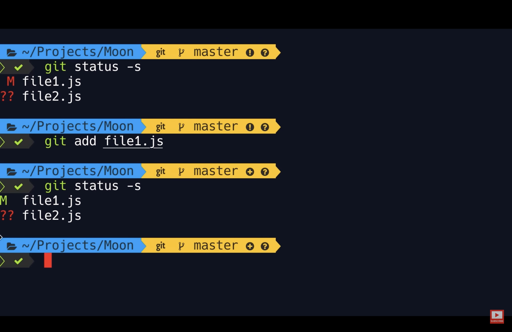
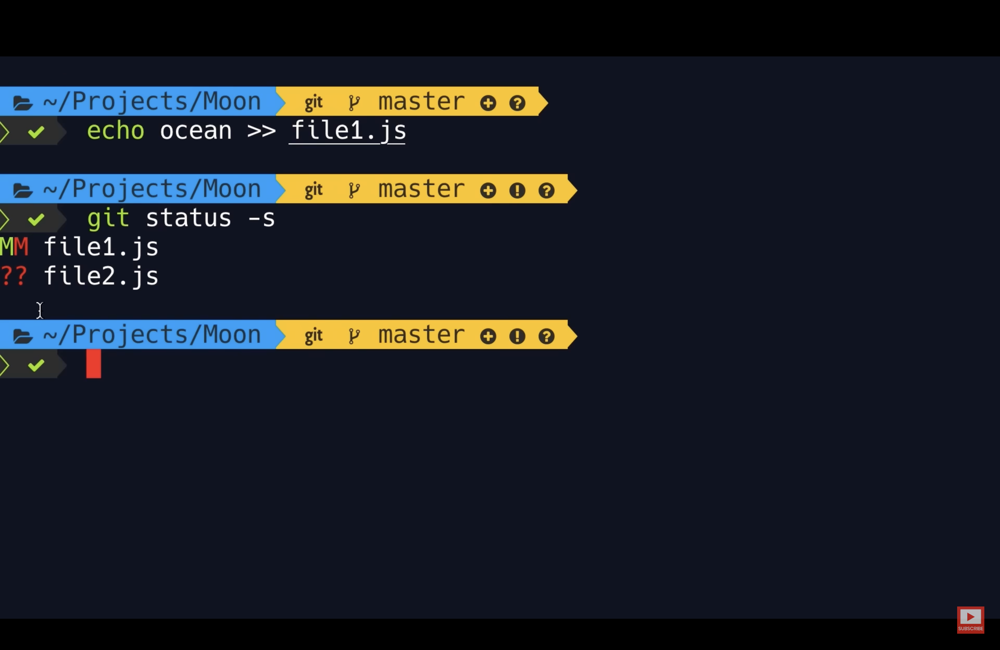
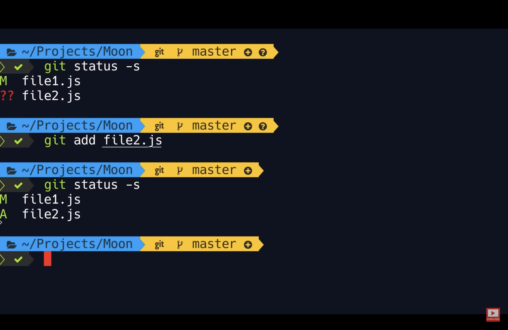
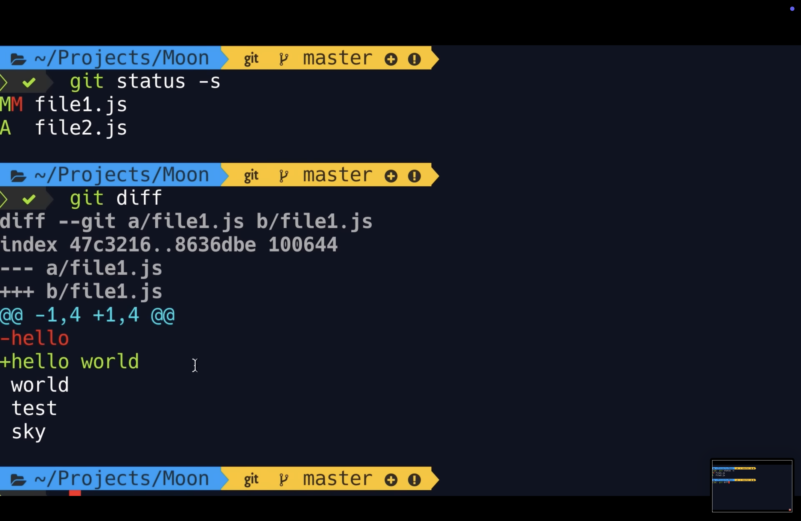

# Initializing a Repo

-   Before committing files in a repo, we need to initialize it.
-   This adds a hidden sub-directory in our dir.

```
mkdir moon
cd moon
git init
```

-   We can see .git hidden folder using **ls -a** command.
-   **ls:** Displays sub-dir of a dir
-   **ls -a:** Displays hidden dir in a dir.

```
ls
ls -a
open .git
```

-   .git is the git dir or git repo where git stores info about our project history

# Git Workflow

-   We have our project dir and a git dir (hidden sub dir of project dir).
-   We make changes in files in our project dir.
-   When our project reaches a state that we want to record, we commit those changes.
-   Creating a commit is like taking a snapshot of our project.

<br>

-   In Git, we have a special intermediate step or area called **Staging Area** or **Index**.
-   It's like what we are proposing for the next commit, we save them here.


-   So, when we are done making changes, we add them to staging area.
-   Then, we review our changes and if everything is fine, then we make a commit.
-   So, the staging area allows us to review our work before recording a snapshot.
-   If we want some changes to be committed as a part of another commit, we can unstage them and then commit them in future.

## Real Example

-   As we commit changes, git maintains our project history where each change has a meaningful commit message.


-   **Misconception:** Whenever we commit changes, staging area becomes empty.
-   That is not true.
-   Staging area contains that same snapshot that we have stored in git repo recently.


Go to https://youtu.be/8JJ101D3knE?si=Xlz4BzTB57PvbhOq&t=1103 to understand a real example in depth.

# Commit

-   Each commit contains:

1. **A unique identifier:** It is generated by git.
2. **Message:** Info about the change.
3. **Date/Time**
4. **Author**
5. **Complete Snapshot:**

-   So unlike other VCS, git does not store what was changed.
-   Instead, it stores the full content of project.
-   With this, we can quickly revert back the project to an earlier snapshot.

<br>

-   Also, this storage of entire content does not waste a lot of space as git is very efficient in data storage.
-   It compresses the content and doesn't store duplicate content.

<br>

-   **Note:** We do not have to know how git stores data as it is a purely implementation detail and may change in future.
-   What we need to know is each commit contains a complete snapshot of our project.

# Staging Files

```
echo hello > file1.txt
# Creates a new file and writes 'hello' in it.

echo hello > file2.txt
```

-   Now, we have 2 untracked files file1.txt and file2.txt

```
git add file1.txt
git add file1.txt file2.txt
git add .
```

-   Now, both files are in staging area.

```
echo world >> file1.txt
```

-   '>>' is used to append to a file.
-   Now, we have two files in staging area and also one modified file.

<br>

-   **Current Situation:**
-   We have one (older) version of file1 in staging area.
-   Then, we made some changes in it.
-   So, we have another (newer) version of file1 in our current dir.
-   It has some changes that has not staged yet.


```
git add .
# Both files are in staging area.
```

# Committing Changes

```
git commit -m "Initial commit."
```

-   **-m:** For message (A short desc of what this change is about.)

<br>

-   If in case we need a longer commit message, we do not write message here.
-   Instead we just run `git commit` and then press enter.
-   It opens up a file from hidden git folder in our default code editor.
-   There we can have commit in following format:


# Committing Best Practices

1. Commit messages should not be too large or too small.

2. Every commit should serve a task.

    - **e.g.** - We should not have a commit which is fixing a bug as well as a typo.
    - Both of them should be 2 separate commits.

3. Convention: Use present tense in commit message.
    - **e.g.** - Fix a bug.

# Skipping the Staged Changes

-   We can skip the staging area and can directly commit our files.
-   But we should do this only when we are 100% sure that there is no need of reviewing our changes.
-   The whole point of having a staging area is so that we can review our code before committing them.

<br>

-   Here's how we can directly commit our code:
-   We have changes made to file1.txt.
-   **-a**: To commit all modified files.

```
git commit -a -m "Fix a bug that prevented users from signing up"

# We can combine "-a -m" to "-am"
git commit -am "Fix a bug that prevented users from signing up"
```

# Removing Files

-   To remove a file we use rm (remove) command.
-   It is not a git command as it does not starts with git.
-   It is just a standard unix command.

```
rm file2.txt
```

-   This way file2 gets deleted from our working dir.
-   But it is present in staging area.

```
git ls-files
# Displays the files present in staging area.

git add file2.txt
git commit -m "Remove unused code."
```

-   So, to remove a file, we need to remove it from our working dir and staging area.
-   Since, this is a very common command, git gives us an easy way to do it.

```
git rm file2.txt

git rm file2.txt file1.txt
# We can specify more files.

git rm file2.txt *.txt
# We can also use patterns like "*.txt".
# This way all the files having .txt extension will get deleted.
```

-   With this command, git removes files from working dir as well as staging area.

# Renaming or Moving Files

-   Using mv (move) command in unix, we can rename or move files and directories.

```
mv file1.text main.js
```

-   Now, we have a deleted file (file1.txt) and an untracked file (main.js).
-   Git doesn't starts to track our files by itself.
-   We have to add it to staging area and then git starts to track it.

```
git add file1.txt
git add main.js
git status
```

-   Now, git recognized that we renamed file1.txt to main.js.


-   So, renaming or moving files is a 2-step operation:

1. We have to modify our working dir.
2. We have to stage 2 types of changes: an addition and a deletion

-   So, similar to removing files, git gives us a special command for renaming or moving files.

```
git mv main.js file1.js
git commit -m "Refactor code."
```

# Ignoring Files

-   In our projects, we have some log and binary files that get generated due to compiling of our code.
-   We do not want to include those files to our repo as it will increase the size of repo without providing any value.

```
mkdir logs
# Creates logs dir in Moon dir.

echo hello > logs/dev.log
git status
```

-   To prevent git from tracking log files, we create a special file called .gitignore.
-   So, this file has no name and only has an extension "gitignore".
-   It should be in the root of our project.

```
git add .gitignore
```

-   But this works only for files that we have not included in our git repo i.e. the files have not been committed yet and are untracked.
-   This is b/z as soon as we commit the file, git starts tracking it and then it will not stop even when we add that file to .gitignore file.

```
mkdir bin
echo hello > bin/app.bin
git status
git add .
git commit -m "Add bin."
```

-   So, now we have a new folder bin.
-   We have accidentally committed its files.
-   Now, add bin/ to .gitignore

```
git add .
git commit -m "Include bin/ in gitignore."
echo helloworld > bin/app.bin
git status
# git shows that app.bin is modified.
```

-   This happen b/z it was already tracking that file.
-   But we do not want git to track app.bin.
-   To solve this problem, we have to remove this file from staging area.

```
git ls-files
# Shows that app.bin is in staging area.
```

-   "git rm" command removes the file from both working dir and staging area.
-   But we want to remove it from staging area only.
-   To do this we use:

```
git rm --cached -r bin/
# --cached: removes file from staging area only.
# -r: for recursive removal (we want to remove entire dir "bin")

git ls-files
git status
git add .
git commit -m "Remove the bin dir that was accidentally committed."
```

-   From now on, git is not going to track files in bin dir.
-   Go to https://github.com/github/gitignore to see various gitignore templates for diff programming languages.

# Short Status

-   We can add a short status flag (-s) in git status command to see the status of our dir in short.

```
echo sky >> file1.js
echo sky > file2.js
git status -s
```

-   The output of this command has two columns:

1. Left Column: It represents the staging area.
2. Right Column: It represents the working dir.


-   Here, we have modified file1.js (M in right column).
-   So, we have some changes but these changes are not there in staging area.
-   That's why, we do not have anything in left column.
-   We have an untracked file file2.js.
-   That's why, we have que mark in left and right column.

<br>



-   Now, we add file1.js to staging area.
-   So, we have green M in left column.

<br>



-   Here, we can see two M.
-   This means that we have some changes added to staging area but there are some new changes that are not yet added to staging area.

<br>



-   Now, we have added file2.js in staging area so we see A (added) in left column.

# Viewing the Staged & Unstaged Changes

-   To see the exact lines of code that has been changed, we use diff command.

```
git diff --staged
# To view staged changes
```


-   In the first line, we are calling diff utility with some arguments.
-   We are comparing `a/file1.js` with `b/file1.js`.
-   So, we are comparing 2 copies of the same file.
-   `a/file1.js` is the old copy that we had in the last commit.
-   `b/file1.js` is the newer copy that we currently have in the staging area.

-   `index 94954ab..c7bc16c 100644` is some meta data.
-   After that, we have a legend.
-   `--- a/file1.js`: Changes in the old copy is indicated by a '-' sign.
-   `+++ b/file1.js`: Changes in the new copy is indicated by a '+' sign.

-   `@@ -1,3 +1,5 @@` is a header with some info about what parts of our file has changed.
-   Here, we have two segments:

1. `-1,3`: prefixed with '-' sign so it gives info about old copy.

    - In the old copy, starting from the 1st line 3 lines have been changed.
    - These lines are shown below.

2. `+1,5`: prefixed with '+' sign so it gives info about new copy.

    - In the new copy, starting from the 1st line 5 lines have been changed.
    - These lines are shown below.
    - Below, 2 line are green and prefixed with a '+' sign.
    - This means these are the new lines that we have added in new copy that has been staged.

-   Then, again we have called diff utility.
-   `--- /dev/null`: file2.js is a new file which was not there in the last commit.
    -   That's why, we see `-0,0`.

```
git diff
# To view unstaged changes
# It compares what we have in working dir v/s what we have in staging area.
```



# Visual Diff Tools

-   Various diff tools are:

    -   KDiff3 (Cross Platform)
    -   P4Merge (Cross Platform)
    -   WinMerge (Windows Only)
    -   VSCode

-   To tell terminal that we want to use VSCode as our default diff tool:

```
git config --global diff.tool vscode
# We are giving a name i.e. vscode to our default diff tool.

git config --global difftool.vscode.cmd "code --wait --diff $LOCAL $REMOTE"
git config --global -e
git difftool
git difftool --staged
```

# Viewing the History

-   To view our history, we use `git log` command.

-   We have our last commit on top.
-   Each commit has a unique identifier which is a 40 character hexadecimal no. that git automatically generates.

`HEAD -> master`:

-   **master** is the main branch in git.
-   **HEAD** is a reference to the current branch.
-   So, this is how git know which branch we are working on.

```
git log --oneline
# This shows a short summary of the commit.

git log --reverse
# Reverses the order of commits.
```

# Viewing a Commit

-   To see exactly what we have changed in a commit, we use show command.

```
git show
```

-   We have to specify the commit that we want to inspect.
-   Two ways to reference a commit:

1. **Using unique identifier:**

```
git show a08d202
git show a08
# We can add fewer characters as long as we don't have another commit having same char in its identifier.
```

2. **Using HEAD pointer:**

-   Currently, HEAD is in front of last commit.

```
git show HEAD
# To view the last commit

git show HEAD~1
# To view the second last commit
```

-   **tilde (~)**: To show previous commits.
-   **1**: No. of steps we want to go back.


-   To see exact version of a file stored in a commit:

```
git show HEAD~1:.gitignore
git show HEAD~1:bin/app.bin
```

-   We know that a commit stores our entire dir.
-   But when we use show command, we only see changes.
-   To see all the files and directories in a commit, we use `git ls-tree`.

## Why is it called tree?

-   A tree is a data structure for representing hierarchal info.
-   In a tree, we can have nodes and these nodes can have children.
-   Every dir can be represented as a tree.
-   So `ls-tree` means list of the files in a tree.


-   This unique identifier gets generated on the basis of the content of a file/dir.
-   So, in git's database, we have an object with this id.
-   files are represented using **blobs** and dir is represented using **tree**.
-   All these are objects that are stored in the git's database.
-   We can see these files and dir using show command and their identifier.

```
git show 64629cd
```

## Git Objects

-   Commits
-   Blobs
-   Trees
-   Tags

# Unstaging Files

-   Earlier, we used `git reset` command but now we use `git restore`.

```
git restore --staged file1.js
git restore --staged file1.js file2.js
git restore --staged file1.js *.js
# To restore staged files

git restore --staged .
# To restore all staged files
```

## How it works?

-   The restore command takes the copy from the next environment.
-   In case of staging area, next environment is last commit.
-   So, git took the last copy of this file from the last snapshot and put it in staging area.

```
git restore --staged file2.js
```

-   file2.js is a new file.
-   So, last snapshot does not have it.
-   So, when we restore it, git removes it from the staging area.

# Discarding Local Changes

-   Sometimes, we want to discard the changes that we made to our working dir.
-   We can do this using restore command.

```
git restore file1.js
```

-   When we run this command, git is going to take the version of this file from next environment (staging area) and copy it to our working dir.

```
git restore .
# To undo all the local changes.
```

-   When we run this, file2.js does not gets undo b/z it is a new file.
-   Git is not tracking it.
-   So, it does not have its previous version that it can restore.
-   It doesn't exist in staging area.

-   To remove these new files, we have to use `git clean` command.

```
git clean -fd
```

**-f**: force to clean files
**-d**: remove whole directories

# Restoring a file to an Earlier Version

```
git rm file1.js
git status -s
git commit -m "Delete file1.js"
```

-   Let's say, we accidentally deleted file1.js.
-   To do this, we will use restore command.
-   We want to restore the file from the second last commit i.e. HEAD~1.
-   We know that by default, it restores files from next environment.
-   To change this source, we can use:

```
git restore --source=HEAD~1 file1.js
git status -s
```
